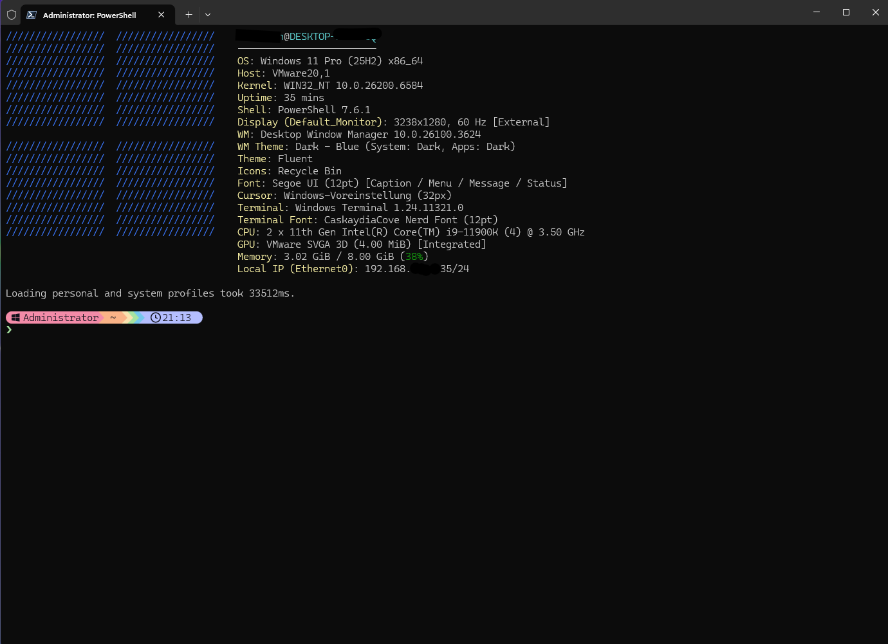

# ⚡ Windows PowerShell 7 Bootstrap

> Automatisches Setup für eine moderne PowerShell 7 Umgebung —
> Ein Doppelklick genügt. Starship, Nerd Font, Fastfetch, Aliase und mehr.


---

## 🚀 Installation — so einfach wie möglich

### Schritt 1 — Dateien herunterladen

Alle drei Dateien in denselben Ordner legen (z.B. `Desktop`):

```
install.bat
profile_windows.ps1
README.md
```

### Schritt 2 — Als Administrator starten

> **Rechtsklick auf `install.bat` → „Als Administrator ausführen"**

Das war's. Das Script erledigt den Rest automatisch:

- ✅ Installiert **PowerShell 7** via winget
- ✅ Installiert **Windows Terminal** falls nicht vorhanden
- ✅ Kopiert das Profil nach `~/Documents/PowerShell/Microsoft.PowerShell_profile.ps1`
- ✅ Setzt **PowerShell 7** als Standardprofil in Windows Terminal
- ✅ Setzt **Windows Terminal** als Standard-Terminalanwendung

### Schritt 3 — Windows Terminal neu starten

Beim ersten Öffnen läuft das Bootstrap automatisch durch (~2–5 Min).

---

## 📁 Dateistruktur

```
windows-setup/
├── install.bat             ← Hier starten (Als Admin ausführen!)
├── profile_windows.ps1     ← PowerShell Profil + Bootstrap
└── README.md               ← Diese Datei
```

Nach der Installation wird das Profil automatisch hierhin kopiert:
```
~/Documents/PowerShell/Microsoft.PowerShell_profile.ps1
```

---

## 📦 Was wird installiert?

### Tools (via winget)

| Tool | Beschreibung |
|---|---|
| **Fastfetch** | Systeminfo beim Terminal-Start |
| **Starship** | Moderner, schneller Prompt |
| **fzf** | Fuzzy-Suche in History & Dateien |
| **zoxide** | Intelligenter `cd`-Ersatz (`j` / `ji`) |
| **eza** | Modernes `ls` mit Icons & Git-Status |
| **fd** | Schnelle Alternative zu `find` |
| **ripgrep** | Blitzschnelle Textsuche (`rg`) |

### PowerShell-Module

| Modul | Beschreibung |
|---|---|
| **Terminal-Icons** | Datei-Icons im Terminal |
| **PSReadLine** | Autocomplete, History, Syntax-Highlighting |
| **PSFzf** | fzf-Integration (`Ctrl+T` History, `Ctrl+R` Dateien) |
| **posh-git** | Git-Status im Prompt |

### Font

| Font | Beschreibung |
|---|---|
| **CaskaydiaCove Nerd Font** | Automatisch heruntergeladen, installiert und in Windows Terminal gesetzt |

### Configs (werden automatisch erstellt)

| Config | Pfad |
|---|---|
| Starship | `~/.config/starship.toml` — Catppuccin Mocha Theme |
| Fastfetch | `~/.config/fastfetch/config.jsonc` — Windows 11 Logo |

---

## ⌨️ Aliase & Funktionen

```
Navigation:   ..  ...  ....  home  mkcd
Dateien:      ls / l / ll / la / lt / lta / lg   (eza-basiert, mit Icons)
              cat (bat)   extract   f (suchen)
System:       update   install   search   df   du   top   psg   ports
Netzwerk:     myip   myip6   localip   gateway   wetter
Git:          gs  ga  gaa  gc  gcm  gp  gpl  gl  gll  gd  gds  gco  gb  gba  gst  gstp
Info:         show_system_info   now   nowdate   week   which   path
Setup:        ps-setup-reset   aliases
```

> Tipp: `aliases` im Terminal eingeben für eine vollständige Übersicht.

---

## 🔄 Setup zurücksetzen

```powershell
ps-setup-reset
```

Danach ein neues Terminal-Fenster öffnen — das Bootstrap startet automatisch neu.

---

## 🧰 Getestet mit

- Windows 11 Pro (23H2 / 24H2 / 25H2)
- PowerShell 7.4+
- Windows Terminal 1.20+
- VMware & Hyper-V VMs

---

## ⚠️ Hinweise

- Das Script benötigt **Administrator-Rechte** nur für die initiale Installation (winget + Registry)
- Die Font-Installation und PowerShell-Module werden **ohne Admin** im User-Kontext installiert
- Alle Configs landen unter `%USERPROFILE%` — keine systemweiten Änderungen

---

## 📜 Lizenz

📝 Lizenz MIT License – frei verwendbar und anpassbar.

Made with ❤️ für alle, die sich in der Shell wohlfühlen wollen.

---

###Created by: sudoAndroed
